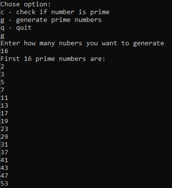

# PrimeNuberRecognizer

## About
Very simple console program that allows user to check whether the entered number is prime and also it can generate selected amout of first prime numbers.

## Usage example

